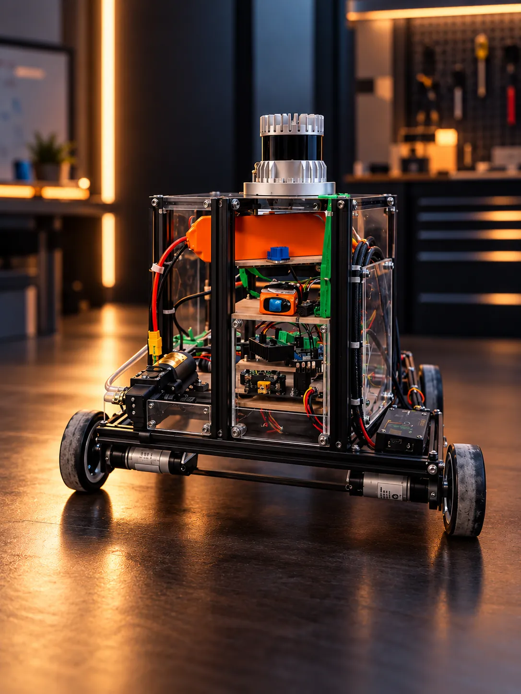
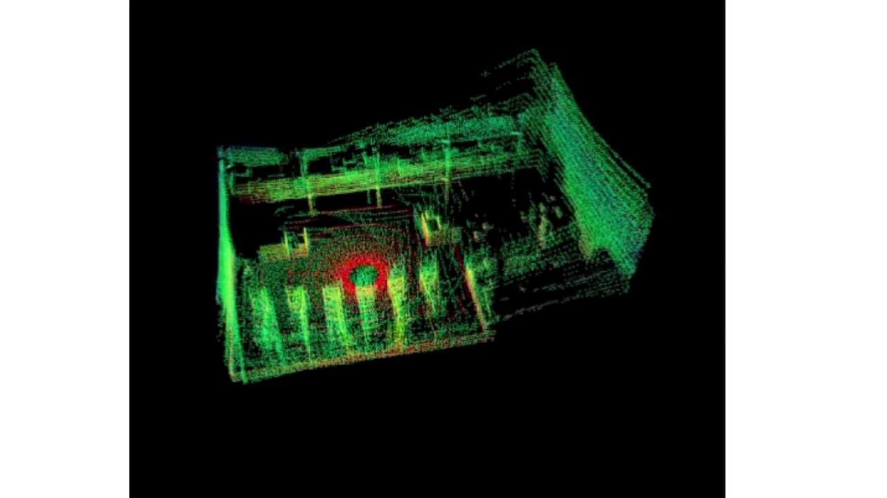
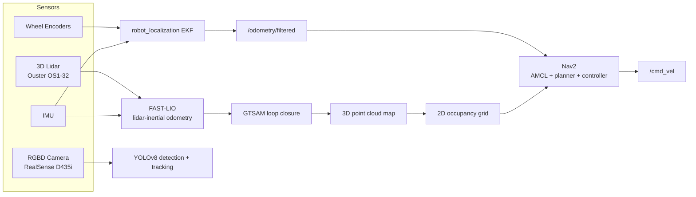
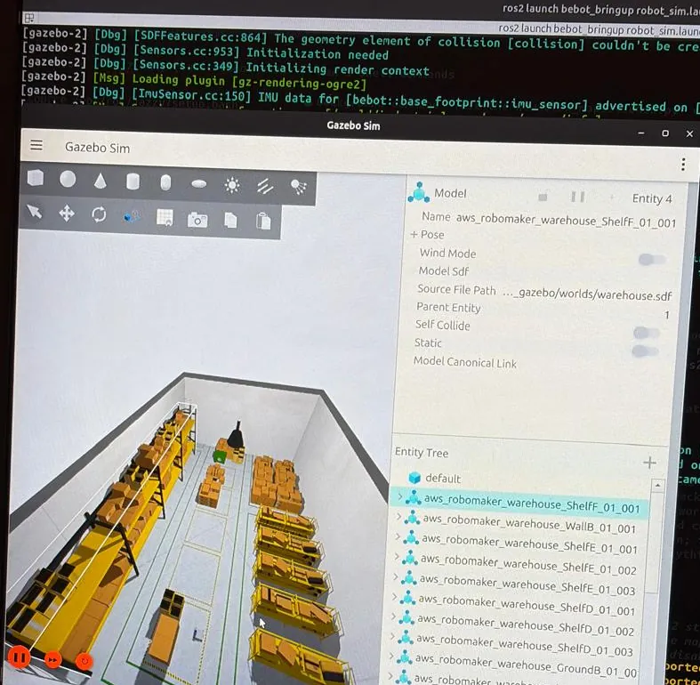
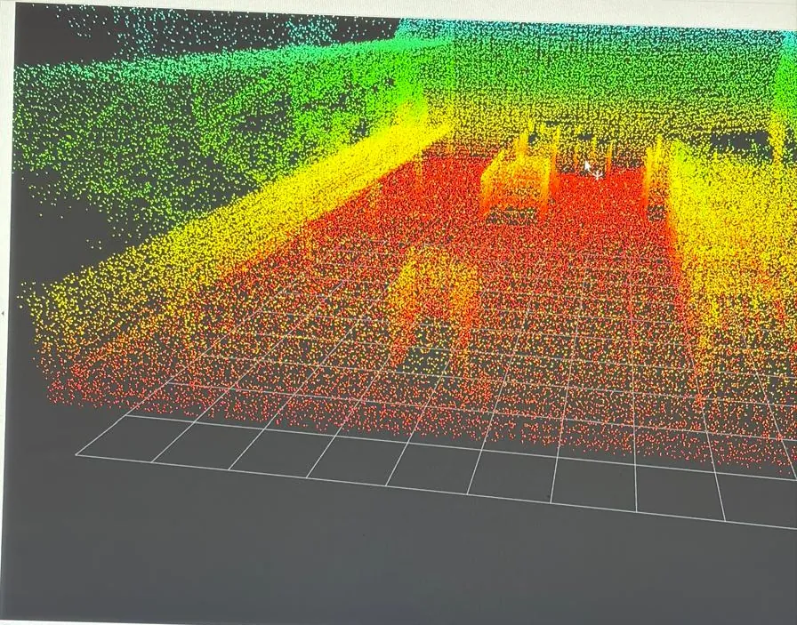
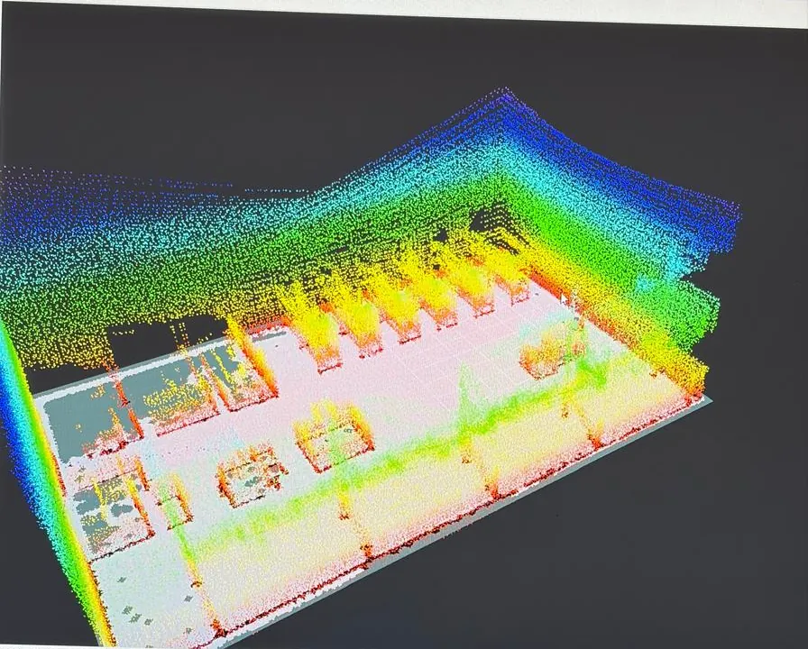
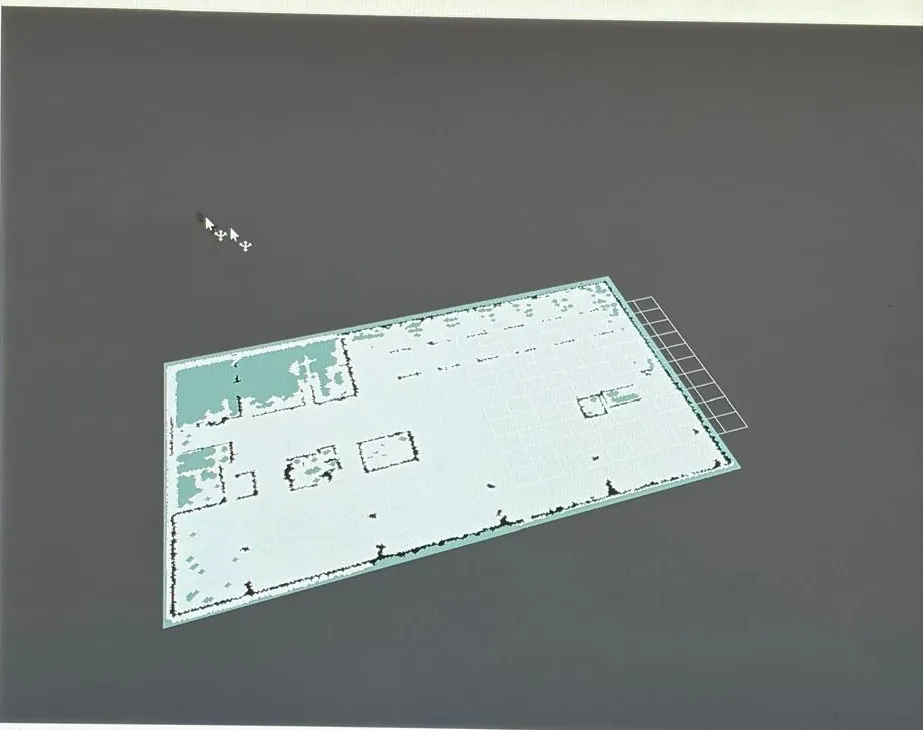

# bebot-amr

A full-stack autonomous mobile robot (AMR) software stack for **bebot**, a custom skid-steer ground robot, built in Gazebo simulation: physics, a simulated 3D lidar + IMU + RGBD camera, EKF sensor fusion, FAST-LIO/GTSAM 3D SLAM with loop closure, Nav2 autonomous navigation, and YOLOv8 object detection.


<p align="center">
  
</p>

<p align="center">
  <a href="media/bebot-lidar-demo.mp4"></a>
  <br><sub>🎥 Live 3D lidar scan (click the image to play the video)</sub>
</p>

---

## What this is

bebot is a 4-wheel skid-steer AMR. This repo is its Gazebo digital twin and the ROS 2 packages that drive it: navigation, mapping, and perception.

| Layer | What it does |
|---|---|
| **Simulation** (`bebot_description`, `bebot_gazebo`) | URDF/xacro robot model, Gazebo Harmonic world + physics, simulated Ouster OS1-32 lidar, IMU, and Intel RealSense D435i RGBD camera |
| **Sensor fusion** (`bebot_odom`) | `robot_localization` EKF fusing wheel odometry velocity + IMU angular velocity into `/odometry/filtered` |
| **3D SLAM** (`bebot_slam`) | FAST-LIO lidar-inertial odometry + a GTSAM pose-graph loop-closure node, producing a globally-consistent 3D point cloud map |
| **Navigation** (`bebot_navigation`) | Flattens the 3D map into a 2D occupancy grid, then Nav2 (AMCL, planner, controller) for autonomous goal-driven navigation |
| **Perception** (`bebot_vision`) | YOLOv8n object detection + tracking + distance estimation from the RGBD camera |
| **Bring-up** (`bebot_bringup`) | Top-level launch files that compose all of the above into one command |

## Architecture



<p align="center">
  
  
</p>
<p align="center">
  
  
</p>
<p align="center"><sub>Gazebo warehouse sim · live lidar scan · loop-closed 3D map · flattened 2D occupancy grid for Nav2</sub></p>

## Prerequisites

- Ubuntu 24.04
- ROS 2 Jazzy
- Gazebo Harmonic (`gz sim`)
- Python 3.12

System packages (covers `robot_localization`, Nav2, GTSAM, and the rest):

```bash
sudo apt update
sudo apt install ros-jazzy-robot-localization ros-jazzy-nav2-bringup ros-jazzy-nav2-amcl \
    ros-jazzy-nav2-map-server ros-jazzy-pointcloud-to-laserscan ros-jazzy-ros-gz-bridge \
    ros-jazzy-ros-gz-sim ros-jazzy-rqt-image-view ros-jazzy-teleop-twist-keyboard \
    ros-jazzy-cv-bridge ros-jazzy-vision-msgs python3-gtsam python3-numpy python3-scipy \
    python3-serial python3-pip
```

Python packages not covered by rosdep/apt:

```bash
pip3 install ultralytics   # YOLOv8 (bebot_vision) — first run auto-downloads yolov8n.pt
```

**FAST-LIO** is a third-party dependency, not included in this repo — clone it alongside the other packages (step below).

## Build

```bash
mkdir -p ~/bebot_ws/src && cd ~/bebot_ws/src

git clone https://github.com/Aradhy22/bebot-amr.git .
git clone https://github.com/hku-mars/FAST_LIO.git

cd ~/bebot_ws
rosdep update && rosdep install --from-paths src --ignore-src -r -y
colcon build --symlink-install
source install/setup.bash
```

> `.` as the clone target for `bebot-amr` places its packages directly in `src/` — this repo's root *is* a workspace's `src/` folder, so packages land correctly alongside `FAST_LIO/`.

## Run — simulation

All commands assume `source install/setup.bash` has been run in a fresh terminal.

**View the robot model in RViz** (no simulation):
```bash
ros2 launch bebot_description display.launch.py
```

**Gazebo simulation only:**
```bash
ros2 launch bebot_gazebo gazebo.launch.py world:=empty.sdf
```

**Full sim bring-up** (Gazebo + EKF + vision), from `bebot_bringup`:
```bash
ros2 launch bebot_bringup robot_sim.launch.py
```

**SLAM mapping** — spawns the robot in the warehouse world and runs FAST-LIO + loop closure:
```bash
ros2 launch bebot_bringup sim_robot_mapping.launch.py
```
Drive it around, then save the map:
```bash
ros2 service call /loop_closure/save_map std_srvs/srv/Trigger
ros2 run bebot_navigation pcd_to_occupancy_grid   # flattens the saved 3D map to a 2D grid
```

**Autonomous navigation**, using a previously-saved map:
```bash
ros2 launch bebot_bringup sim_robot_navigation.launch.py map:=/path/to/warehouse_map.yaml
```

**Manual teleop:**
```bash
ros2 launch bebot_bringup teleop.launch.py
```

## Engineering highlights

A few of the harder problems this project actually involved solving, beyond wiring packages together:

- **EKF acceleration double-integration bug.** The sensor fusion config originally fused raw IMU linear acceleration; a small constant bias grows *quadratically* once double-integrated into position, and `/odometry/filtered` measurably diverged tens of meters within ~5 minutes of runtime. Fixed by fusing only angular velocity from the IMU and velocity (not position) from wheel odometry, leaving position integration entirely to the filter.

## Repository structure

```
bebot_bringup/      top-level launch files (sim bring-up, mapping, navigation, teleop)
bebot_description/  URDF/xacro model + RViz display
bebot_gazebo/        Gazebo Harmonic worlds and simulation launch
bebot_odom/          EKF sensor fusion (robot_localization)
bebot_slam/          FAST-LIO + GTSAM loop closure 3D mapping
bebot_navigation/    2D map generation + Nav2 autonomous navigation
bebot_vision/        YOLOv8 object detection and tracking
```

## License

MIT — see [LICENSE](LICENSE). Note that [FAST-LIO](https://github.com/hku-mars/FAST_LIO) is a separate upstream dependency under its own license and is not redistributed here.
